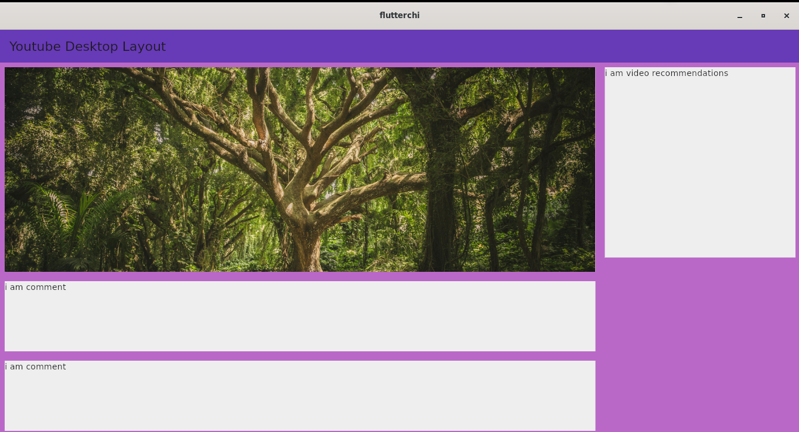

# flutterchi
Please check out all the branches)
basic mobile layout:

basic desktop layout:

Useful Links:
https://pub.dev/
- [Cookbook: Useful Flutter samples](https://docs.flutter.dev/cookbook)
[online documentation](https://docs.flutter.dev/)
