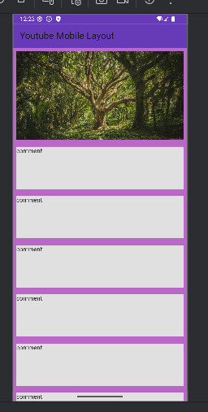

# First step layout

[//]: # (Basic desktop layout:)

[//]: # ()
[//]: # (![./images/mobile.png]&#40;images/desktop.png&#41;)
Basic mobile layout:

Useful Links:

- https://pub.dev/
- [Cookbook: Useful Flutter samples](https://docs.flutter.dev/cookbook)
  [online documentation](https://docs.flutter.dev/)

P.S., please checkout all branches