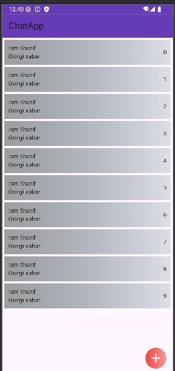
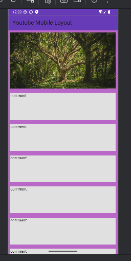

# First Step Layouts

Useful links:
-https://pub.dev/
- [Cookbook: Useful Flutter samples](https://docs.flutter.dev/cookbook)
[online documentation](https://docs.flutter.dev/)

telegram-settings-widgetbook-practice branch:

ui-chatapp branch:

yt-layout branch:

P.S., Please check out all the branches)
